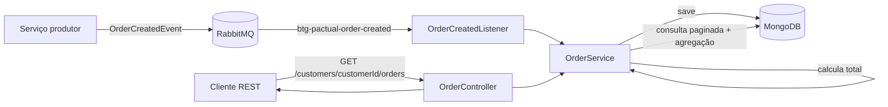

# 📦 OrderMS

> Microsserviço de processamento de pedidos com **Java 21, Spring Boot, RabbitMQ e MongoDB**.

<p align="left">
  
  
  
  
  
</p>

## 🎯 Sobre o projeto

O **OrderMS** é um microsserviço de pedidos desenvolvido para praticar integração assíncrona entre sistemas usando mensageria.

O serviço consome eventos de criação de pedido a partir de uma fila RabbitMQ, converte a mensagem recebida para o domínio da aplicação, calcula o valor total do pedido e persiste os dados no MongoDB. Em seguida, uma API REST permite consultar os pedidos de um cliente com paginação e o valor total acumulado das compras.

O projeto demonstra conceitos importantes de backend, como:

- comunicação assíncrona com RabbitMQ;
- arquitetura orientada a eventos;
- consumo de mensagens com `@RabbitListener`;
- persistência de documentos com MongoDB;
- agregações com `MongoTemplate`;
- paginação com Spring Data;
- separação entre Controller, Service, Repository e DTOs;
- configuração por variáveis de ambiente;
- infraestrutura local com Docker Compose.

---

## ✨ Destaques técnicos

- ✅ Java 21
- ✅ Spring Boot 3.3.3
- ✅ Spring Web
- ✅ Spring AMQP
- ✅ RabbitMQ Consumer
- ✅ Conversão JSON com Jackson
- ✅ MongoDB
- ✅ Spring Data MongoDB
- ✅ Agregação de valores com `MongoTemplate`
- ✅ API REST paginada
- ✅ Docker Compose
- ✅ Maven Wrapper

---

## 🏗️ Arquitetura



### Fluxo de processamento

```text
Evento de pedido criado
        ↓
RabbitMQ
        ↓
Fila btg-pactual-order-created
        ↓
OrderCreatedListener
        ↓
OrderService
        ├── mapeia itens
        ├── calcula total
        └── persiste pedido
        ↓
MongoDB
        ↓
API REST de consulta
```

---

## 🧠 Como o processamento funciona

O consumidor está conectado à fila:

```text
btg-pactual-order-created
```

Quando uma mensagem chega, o `OrderCreatedListener` consome o evento e delega o processamento ao `OrderService`.

O serviço calcula o total de cada pedido com a regra:

```text
preço × quantidade
```

para todos os itens e persiste o resultado no MongoDB.

Além da consulta dos pedidos, o serviço executa uma agregação no MongoDB para calcular o valor total comprado por um cliente.

---

## 📩 Contrato do evento

Exemplo de mensagem esperada pelo consumidor:

```json
{
  "codigoPedido": 1001,
  "codigoCliente": 2001,
  "itens": [
    {
      "produto": "Notebook",
      "quantidade": 1,
      "preco": 3500.00
    },
    {
      "produto": "Mouse",
      "quantidade": 2,
      "preco": 120.00
    }
  ]
}
```

Nesse exemplo, o valor total calculado pelo serviço será:

```text
3500.00 + (2 × 120.00) = 3740.00
```

---

## 🌐 API REST

### Consultar pedidos de um cliente

```http
GET /customers/{customerId}/orders
```

Parâmetros opcionais:

| Parâmetro | Padrão | Descrição |
|---|---:|---|
| `page` | `0` | Página atual |
| `pageSize` | `10` | Quantidade de registros por página |

Exemplo:

```bash
curl "http://localhost:8080/customers/2001/orders?page=0&pageSize=10"
```

A resposta possui três blocos:

```json
{
  "summary": {
    "totalOnOrders": 3740.00
  },
  "data": [
    {
      "orderId": 1001,
      "customerId": 2001,
      "total": 3740.00
    }
  ],
  "pagination": {
    "page": 0,
    "pageSize": 10,
    "totalElements": 1,
    "totalPages": 1
  }
}
```

---

## 🛠️ Stack

| Tecnologia | Papel no projeto |
|---|---|
| Java 21 | Linguagem principal |
| Spring Boot 3.3.3 | Framework backend |
| Spring Web | API REST |
| Spring AMQP | Integração com RabbitMQ |
| RabbitMQ | Broker de mensagens |
| Jackson | Conversão JSON |
| Spring Data MongoDB | Persistência e paginação |
| MongoDB | Banco de dados orientado a documentos |
| MongoTemplate | Agregação do total de pedidos |
| Docker Compose | Infraestrutura local |
| Maven | Build e dependências |

---

## 📁 Estrutura principal

```text
orderms/
├── .env.example
├── .gitignore
├── local/
│   └── docker-compose.yml
├── orderms/
│   ├── pom.xml
│   ├── mvnw
│   ├── mvnw.cmd
│   └── src/
│       ├── main/java/tech/DevJucelio/btgpactual/orderms/
│       │   ├── config/
│       │   ├── controller/
│       │   ├── entity/
│       │   ├── listener/
│       │   ├── repository/
│       │   └── service/
│       └── main/resources/
│           └── application.properties
└── README.md
```

---

## 🚀 Como executar

### Pré-requisitos

- Java 21
- Docker Desktop
- Docker Compose
- Git

### 1. Clone o repositório

```bash
git clone https://github.com/juceliocoelho2022/orderms.git
cd orderms
```

### 2. Configure o ambiente

Copie o exemplo de variáveis:

```bash
cp .env.example .env
```

No Windows PowerShell:

```powershell
Copy-Item .env.example .env
```

O `.env` é local e não deve ser versionado.

### 3. Suba MongoDB e RabbitMQ

```bash
cd local
docker compose --env-file ../.env up -d
```

Serviços disponíveis:

| Serviço | Endereço |
|---|---|
| MongoDB | `localhost:27017` |
| RabbitMQ AMQP | `localhost:5672` |
| RabbitMQ Management | `http://localhost:15672` |

### 4. Execute a aplicação

Abra outro terminal:

```bash
cd orderms
```

Linux/macOS:

```bash
./mvnw spring-boot:run
```

Windows:

```powershell
.\mvnw.cmd spring-boot:run
```

Defina as variáveis do MongoDB no ambiente antes de iniciar a aplicação quando usar credenciais diferentes dos valores padrão de desenvolvimento.

---

## 🐇 Testando pelo RabbitMQ Management

Acesse o painel de gerenciamento do RabbitMQ em:

```text
http://localhost:15672
```

Localize a fila:

```text
btg-pactual-order-created
```

Publique uma mensagem JSON compatível com o contrato mostrado neste README. Depois consulte a API REST para verificar o pedido persistido.

---

## 🔐 Configuração e segurança

Dados sensíveis não ficam mais fixos no código-fonte. O `application.properties` utiliza variáveis de ambiente:

```text
MONGO_HOST
MONGO_PORT
MONGO_DATABASE
MONGO_AUTH_DB
MONGO_USERNAME
MONGO_PASSWORD
```

O arquivo `.env.example` documenta as chaves necessárias, enquanto o arquivo `.env` real é ignorado pelo Git.

> Para ambientes reais, utilize um gerenciador de segredos e nunca mantenha senhas de produção no repositório.

---

## 🗺️ Roadmap

### Evolução recomendada

- [ ] Testes unitários para `OrderService`
- [ ] Testes de integração com Testcontainers
- [ ] Tratamento de mensagens inválidas
- [ ] Retry controlado no consumidor
- [ ] Dead Letter Queue
- [ ] Idempotência por `orderId` ou `eventId`
- [ ] Logs estruturados
- [ ] Correlation ID
- [ ] Spring Boot Actuator
- [ ] OpenAPI / Swagger
- [ ] GitHub Actions

---

## 🎓 Conceitos demonstrados

`Java 21` · `Spring Boot` · `RabbitMQ` · `Spring AMQP` · `MongoDB` · `Event-Driven Architecture` · `REST API` · `Spring Data` · `MongoTemplate` · `Paginação` · `Docker Compose` · `Maven`

---

## 👨‍💻 Autor

**Jucelio Farias Coelho**

Java Backend Developer em desenvolvimento profissional, com foco em Java, Spring Boot, mensageria, bancos de dados e sistemas distribuídos.

- GitHub: https://github.com/juceliocoelho2022
- LinkedIn: https://www.linkedin.com/in/jucelio-desenvolvedor-sistema

---

## 📌 Status

🚧 Projeto em evolução. O núcleo atual implementa **consumo de pedidos via RabbitMQ, persistência em MongoDB e consulta REST paginada com agregação de valores**.
